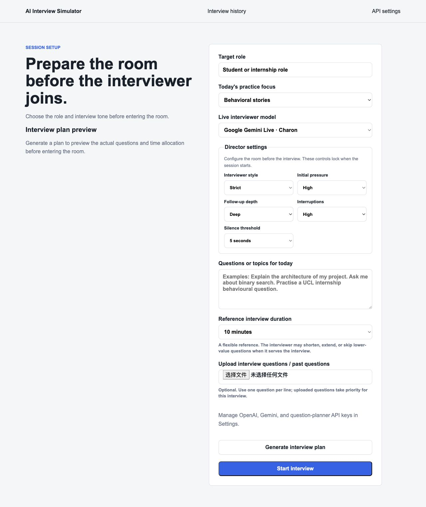
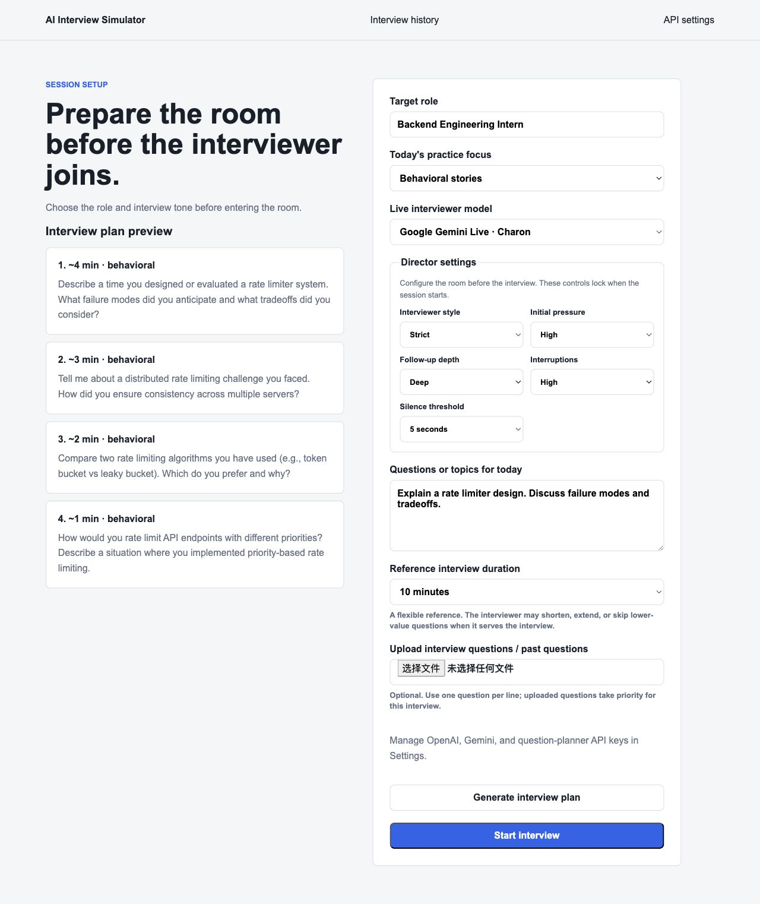
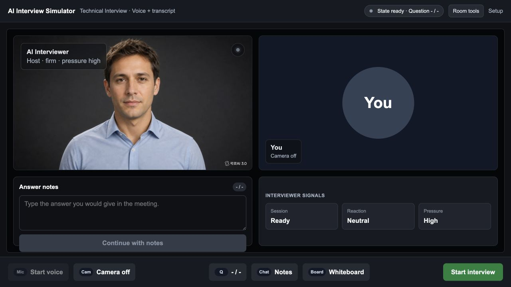
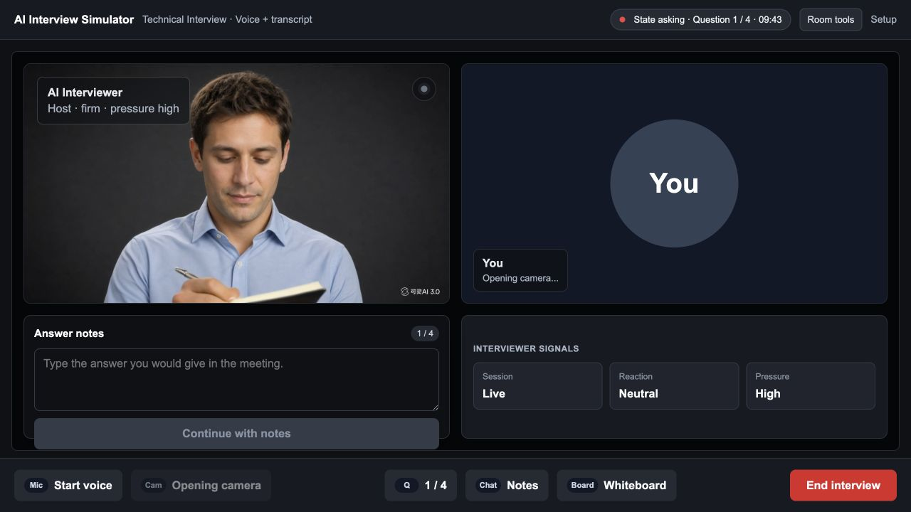
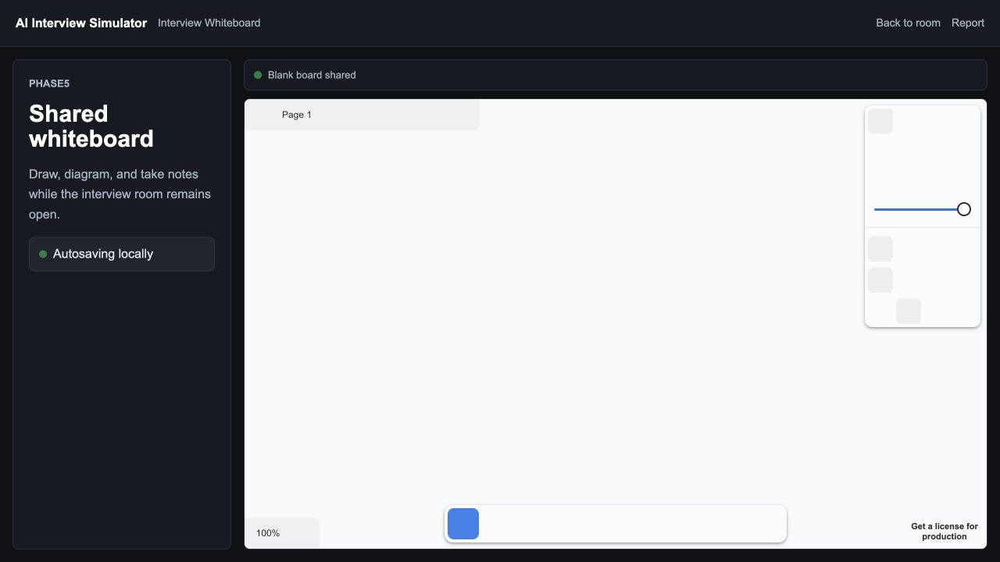
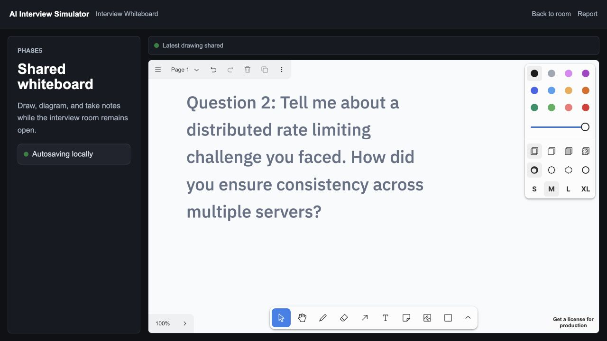
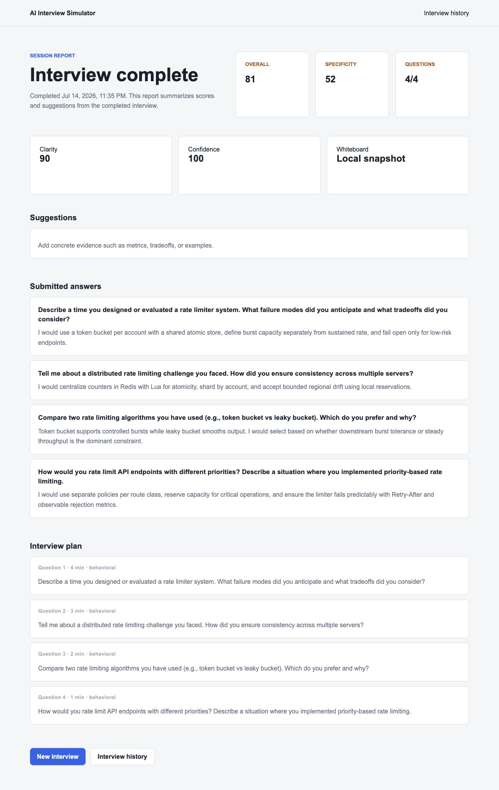
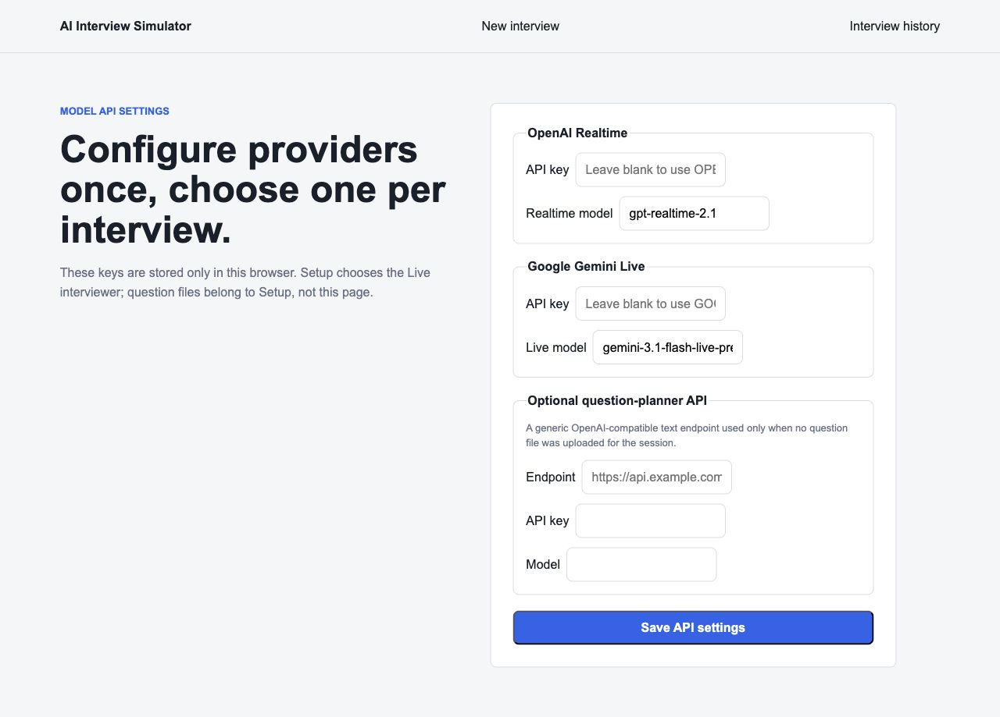

# AI Interview Simulator 最终审计与产品调研报告

审计日期：2026-07-15
审计范围：产品流程、前后端逻辑、Director 状态机、实时语音、白板、报告、存储、启动器、自动化测试、必要文档与发布风险。

## 1. 结论

当前版本已经形成一条可运行、可解释、可回归的本地 MVP 主链路：

```text
设置与计划预览
  → 候场
  → 创建服务端 Director 会话
  → 实时语音或文字答题
  → Director 校验追问/推进
  → 白板同步与受控批注
  → 自动完成或手动结束
  → 固化报告、对话、计划和白板
  → 历史报告
```

三轮修复后，生产构建、56 个 Python 测试和 15 个前端测试全部通过。核心本地流程可用；但该产品仍然是“单机研究原型”，不能直接公开部署，也不能把当前启发式分数用于真实招聘决策。

发布判断：

- 本机个人练习：通过。
- 小范围受控可用性测试：有条件通过，需要接受第三方素材/SDK 水印和评分局限。
- 公网、多用户或真实招聘：不通过，必须先补认证、密钥管理、数据保护、许可和语义评分。

## 2. 产品定位与用户价值

产品不是普通聊天机器人，而是一个带有明确流程边界的模拟面试房间。目标用户是希望练习表达、技术推理、项目复盘和案例分析的学生或实习求职者。

核心价值由五部分构成：

1. 面试前把目标职位、题型、时长、风格和压力配置清楚。
2. 规划器按难度、复杂度和推理空间分配题目时间，而不是平均分配。
3. 实时模型负责自然对话，Director 负责状态、上限和真实进度。
4. 白板既是考生工作区，也是模型可观察、可有限批注的共享上下文。
5. 结束后保存计划、回答、语音对话、白板和稳定评分，形成可复盘记录。

## 3. 功能与实现方法

### 3.1 设置与面试规划

前端 `PracticePlan` 保存职位、练习重点、话题、题库文件、语音提供方、Director 参数和参考分钟数。设置保存在浏览器 localStorage。

“生成计划”调用 `POST /interview/plan`。后端规划提示词要求：

- 题目数量在 1–20 之间；
- 总时间完整分配；
- 难题、系统复杂度、歧义、权衡和独立推理空间获得更多时间；
- 开场或验证题获得更少时间；
- 时间是参考值，允许实际面试缩短、延长或跳过低价值问题；
- 不因最终答案错误而忽略优秀思路。

当输入含有 `1.`、`2.`、`3.` 等编号题时，系统把每个编号及其后续的文字、公式和换行视为一整道题。后端先为编号题、上传题库段落和逐行话题建立稳定的 source ID，再要求规划提供方逐项按原顺序返回；数量或 source ID 不一致的输出会被拒绝。完整题目的原文由后端锁定，模型只能补充重点、追问和时间，不能合并、遗漏、乱序或改写题目。

规划提供方是生成计划的必经步骤：无 Key、认证失败、网络错误或不合格输出都会显示明确错误，且不能进入候场或自动换成本地题目。用户需要先恢复规划 API，再生成可预览的计划。

职位、题型、话题、上传题目或时长一旦改变，旧计划立即失效，避免用新配置启动旧题目。

### 3.2 Director 状态机

Director 是服务端唯一的面试状态权威：

```text
asking ↔ follow_up → completed
   └──────────────→ ended
```

每个会话持有：当前题目、题号、计划总数、回答、追问使用记录、压力、态度、视觉控制信号和锁定配置。

约束规则：

- 低于 0.65 置信度的模型控制提议被拒绝；
- 中断根据 low/medium/high 使用 0.95/0.85/0.75 阈值；
- 每道计划题最多接受一次模型追问；
- `move_on` 必须附带当前考生回答，才能记录并推进一题；
- 模型不能直接结束会话；
- 已完成或已结束会话拒绝后续控制提议；
- 真实进度始终来自服务端题号和计划长度。

正常归档后，会话从内存删除。未归档会话采用六小时惰性 TTL 清理，避免长期运行时无限积累。

### 3.3 时间控制

面试使用总参考时长和逐题分配时间：

- 到单题预算 80%：提醒模型收束到方法、关键假设和证据；
- 到单题预算：要求高效关闭问题，卡住时只问验证步骤或关键权衡；
- 总时长剩余 10% 或 60 秒：引导总结，不再开启新的深问题；
- 到 0：执行真实结束流程。

这些提示不替考生作答，也不使用前端静默阈值截断录音。Gemini Live 自己负责语音回合检测；前端音量检测只用于说话状态和时长遥测。

### 3.4 实时语音

Gemini Live：

- 浏览器采集单声道音频并通过本地 FastAPI WebSocket 代理发送；
- 默认使用固定成年男声；
- 输入/输出转录进入本地报告；
- 隐藏工具提交情绪、动作、追问/挑战/推进和白板提议；
- Director 审批后返回实际题号、总数、状态和下一题；
- 模型据此报告真实进度并继续。

浏览器 API Key 不再放入 `/google/live?...` URL，而是在 WebSocket 建立后的第一条配置消息中发送，降低密钥出现在访问日志和历史记录中的风险。

OpenAI Realtime：

- 后端创建短期 client secret；
- 浏览器通过 WebRTC 发送音频；
- 固定使用男声 Ash；
- 当前仍需要文字笔记提交来推进 Director，尚未达到 Gemini 路径的免手动推进能力。

### 3.5 面试房间与采访者表现

房间保持四个核心区域在一个视口内：面试官、考生摄像头、答案笔记、面试信号。当前问题直接显示在答案框上方，因此即使音频失败，用户也知道正在回答什么。

面试官使用静态底图和短视频片段：眨眼、点头、思考、前倾、看屏幕、记录和说话。只有当前动作或语音播放时占用视频解码器，结束后回到静态图，避免循环动作和暂停按钮问题。

摄像头和麦克风请求都增加 15 秒超时；迟到的媒体流会立即停止，不会让页面永久停在设备授权阶段。

### 3.6 白板

白板使用 tldraw，页面与面试房间通过 BroadcastChannel 通信。

本轮收束后的规则：

- 当前题目同时保存到 localStorage；白板晚打开也能恢复首题；
- 每次换题只替换 AI 题头，不叠加旧题；
- 考生自己的图形不被自动删除；
- 白板导出 JPEG，最长边缩小到 1280，发送给实时模型；
- AI 返回相对图片的 0–1 坐标；白板再映射到当前页面范围；
- 后端限制最多四个动作、最多一个文字批注、文字长度、坐标范围和必填几何参数；
- 只有与看白板、记录或题目过渡有关的已批准提议才会执行；
- 可执行文字、总结、箭头、线、红圈和高光，不允许自动擦除考生内容。

### 3.7 报告与历史记录

结束流程先构建浏览器报告，再请求最终白板帧并调用 `/interview/archive`。每个记录目录包含：

```text
report.json         回答、设置摘要和固化评分
conversation.json   文字提交与按时间排序的语音转录
plan.json           真实题目、重点和时间分配
whiteboard.jpg      可选的最终白板
```

归档先写入同目录下的临时目录，所有文件成功后再用一次原子重命名发布。并发重复请求只有一个能够取得会话；写盘失败会删除临时内容并恢复会话供重试。历史页提供“删除—再次确认”两步操作，删除的是整份本地记录。

历史报告直接读取归档时保存的评分，不会因为以后修改评分代码而悄悄改变旧报告。旧记录没有固化评分时才兼容性地重新计算。

评分目前是带版本号 `local-heuristic-v2` 的确定性基线：清晰度、具体性、推理深度证据、完成度和综合分。推理项检查是否明确展现结构、假设、方案比较、验证和风险，并在综合分中占 40%；它不判断结论是否正确，也不能可靠判断考生是否独立完成。页面明确说明这些只是本地练习指标。原先把“回答了多少题”误标为 Confidence，现已更名为 Completion。长度统计增加中日韩字符支持。

## 4. 本轮发现并解决的问题

| 严重度 | 问题 | 修复 | 影响 |
|---|---|---|---|
| P0 | Gemini 语音可以聊天但 `move_on` 被 Director 强制降级，真实题号无法免手动推进 | `move_on` 改为必须携带考生回答，由 Director 记录并推进；工具结果返回真实进度 | Gemini 语音主流程现在能形成真实的多题会话和报告 |
| P0 | 重放同一次 `move_on` 或多个结束触发可能重复推进、重复归档 | Director 增加重复语音回答保护；前端增加单次结束锁，并优先采用最新真实考生转录 | 不会因工具重放、计时器和手动结束竞争而跳题或生成多份记录 |
| P0 | 第一题在白板未打开时通过 BroadcastChannel 丢失 | 当前题目增加 localStorage 持久化和挂载恢复 | 晚打开白板也能看到当前题 |
| P1 | 所有新题写在同一坐标，连续叠加 | 给 AI 题头加元数据，换题前只删除旧题头 | 保留考生内容，同时避免题目遮挡 |
| P1 | AI 按截图像素返回坐标，但白板直接当页面坐标使用 | 工具坐标改为 0–1，并按导出边界映射 | 圈画、箭头和高光位置更可靠 |
| P1 | 前端直接执行模型白板参数，后端未解析该字段 | 增加 Pydantic 模型和后端二次审核 | 非法、越界、过量或无上下文批注被拒绝 |
| P1 | 浏览器 Gemini Key 进入 WebSocket URL | Key 改为连接后的首条配置消息 | 降低日志、代理和历史 URL 泄露风险 |
| P1 | 随机弹出“网络下降/日历提醒”等虚构事件 | 删除随机计时器、状态、遥测类型、UI 和 CSS | 页面只显示真实系统状态 |
| P1 | 静默阈值仍在 UI、API、状态机和文档，但实际不控制录音 | 完整删除该字段和死状态 | 语义与实现一致，不再误导用户 |
| P1 | 评分把完成率显示成 Confidence | API、类型、页面和存档统一改为 Completion | 避免虚假的心理/表达置信度结论 |
| P1 | Completion 以已提交回合为分母，提前结束也可能显示 100%，追问还会重复增加回答数 | 以计划总题数为分母，并按服务端问题 ID 去重主回答、语音回答和追问 | 提前结束显示真实完成率，同一题多轮交流只算完成一道题 |
| P1 | 规划后修改输入仍保留旧计划 | 相关输入变化时清空计划 | 不会以旧题启动新设置 |
| P1 | 多道编号题被当作一个泛泛的话题，规划不可用时又补进无关通用题 | 后端按编号分组并保留续行/公式；规划提示词规定题目数、顺序和边界；旧版预览自动失效；取消本地计划回退 | 编号粘贴题只能由规划模型逐题显示和执行；失败会明确报错而不是产生假计划 |
| P1 | 归档后历史分数每次重新计算 | 归档时固化 evaluation | 历史记录可复现 |
| P1 | 正常完成的会话永久留在后端字典 | 归档删除，未归档会话六小时 TTL | 长时间运行的内存增长受控 |
| P1 | 多文件归档中途失败会留下半份记录；并发结束可能写出两份 | 临时目录完整写入后原子重命名；归档前独占会话，失败时恢复；页面保留 Retry permanent archive | 历史列表只看到完整记录，磁盘或后端短暂失败可从结束页重试，重复归档被阻止 |
| P1 | 双击启动器会无条件重启服务并摧毁正在进行的内存会话 | 健康的前后端直接复用，只在服务不完整或不健康时重启 | 重复打开本地软件不再中断当前面试 |
| P1 | 新面试可能继承上一次未完成白板；候场页还可能显示与用户选择不一致的模型 | 启动前重置旧白板工作区；候场与面试严格使用已保存选择 | 新会话不会混入旧字迹，也不会暗中切换提供方 |
| P2 | 当前问题只在隐藏工具抽屉里可见 | 在答案笔记上方显示当前题 | 音频失败和无障碍场景仍可答题 |
| P2 | 摄像头或麦克风授权可能永久等待 | 两类媒体都增加 15 秒超时并清理迟到媒体流 | 启动按钮不会无限卡住 |
| P2 | 设置页 API 输入在窄卡片内横向挤压 | 直接字段改为纵向网格并限制宽度 | 密钥和模型输入不再裁切布局 |
| P2 | 设置页曾存在无法执行的浏览器规划 API | 第一轮删除死代码；本地版本随后按需求恢复为唯一的可执行 Planning text model 设置，并限制为 HTTPS endpoint | 用户可在页面配置文本规划模型，不暴露提供方名，也不允许请求本机或内网地址 |
| P2 | 历史报告无法从产品内删除 | 新增后端整目录删除和前端两步确认 | 本地用户可清理报告、转录、计划与白板，不依赖 Finder |
| P2 | 评分只看长度、证据词和完成率，几乎不奖励推理过程 | 新增推理结构、假设、比较、验证、风险五组证据指标，并给出非语义免责声明 | 离线反馈更贴近练习目标，同时避免冒充正确性判断 |
| P2 | AI 白板批注只能默认开启 | Setup 增加自动批注开关；题目显示不受影响 | 用户可以保留共享题目但阻止自动圈画和文字批注 |
| P2 | 未使用的独立文字生成 API 与实时语音职责重复 | 删除 `/google/generate`、模型、辅助函数、环境示例和对应死测试 | 后端表面积更小，不再维护两条 Gemini 文字路径 |
| P2 | 实时提供方烟雾脚本仍使用旧 WebSocket 握手和错误的 Director 请求结构 | 首帧发送 `clientConfig`，并使用真实 `session_id` 调用审批接口 | 可选真机脚本与当前协议重新一致；它仍不会被离线回归自动执行 |
| P2 | 文档仍写 Phase4/Phase5、占位 3D 和静默逻辑 | 更新 README、需求、架构、Director、测试和路线图 | 文档重新与代码一致 |
| P3 | 根目录存在第二套工作区依赖锁、约 400 MB 重复依赖、空 assets、缓存、`.gitkeep` 和 `.DS_Store` | 保留 `frontend/package-lock.json` 作为唯一前端锁文件，删除重复安装与生成垃圾 | 安装入口唯一，减少磁盘占用和依赖版本歧义 |

## 5. 仍然存在的风险

### 阻止公网发布

1. 没有用户认证、权限控制、租户隔离和数据库。FastAPI 只应绑定 `127.0.0.1`。
2. 浏览器手动输入的 API Key 存在 localStorage，任何同源 XSS 都可能读取。公网产品应改为服务端密钥或短期令牌。
3. 报告、语音转录和白板以明文写入本地项目目录，没有加密或自动保留周期；现在已有逐份删除入口，但仍没有批量清理和同意流程。
4. tldraw 页面显示 “Get a license for production”；正式商业发布前必须确认并配置许可。
5. 面试官素材带生成工具水印，缺少仓库内的来源、商用范围和授权记录。

### 影响产品可信度

1. 当前新增的推理深度仍是可见语言证据启发式，不能真正判断技术正确性或独立完成度。它只能作为练习提示，不应作为录用依据。
2. OpenAI Realtime 路径尚未接入与 Gemini 等价的 Director 工具推进，属于“实时语音 + 文字推进”，不是完整免手动体验。
3. 实时模型、麦克风、摄像头和第三方网络行为无法由纯单元测试覆盖；每次模型或协议升级后仍需真机回归。
4. 白板语义护栏主要依赖提示词和结构限制，无法形式化证明模型绝不会写出过多答案；高风险场景仍应提供撤销/关闭 AI 批注开关。
5. 当前工作树没有可用的 Git 基线，全部项目文件显示为未跟踪，无法做可靠的历史差异、回滚和责任追踪。

### 一般工程风险

1. 活跃会话存在内存中，后端重启会丢失；本地 MVP 可接受，正式产品需要持久化状态机。
2. 规划提供方失败会回退到本地计划，虽然现在会明确显示来源，但仍没有重试、配额和错误分类。
3. 原子重命名避免发布半份记录，但进程在写临时目录时被强制终止仍可能留下隐藏 `.tmp` 目录；当前不会展示它，也没有自动老化清理。
4. 当前没有自动化浏览器 E2E 和真实音频夹具，UI 回归主要靠构建、组件逻辑测试和人工流程。

## 6. 流程审计结果

### 设置与计划：健康

实际验证了职位、话题、时长、风格、压力、追问深度、挑战频率、语音模型、题库上传和计划预览。确认规划时间不是平均分配。修复了旧计划失效问题和规划来源不透明问题。





### 候场与启动：健康

候场页不会提前创建会话；Start interview 创建服务端会话，按钮变成 End interview。摄像头和语音失败不会阻止文字答题，两类媒体等待均已有超时。



### 面试与进度：修复后健康

审计时确认页面原本没有明显显示当前题，现已补在 Answer notes 上方。文字提交和经审批的 Gemini `move_on` 都更新同一个服务端状态机，进度不再由前端猜测。



### 白板：修复后健康，许可待处理

审计取证复现了“首题丢失”和“第二题才出现”的问题，现已通过持久化恢复和题头替换修复。AI 批注的坐标与审核链路也已收束。SDK 生产许可仍是发布阻断项。





### 报告与计划：本地归档健康，语义评分仍待建设

实际完成四题后，报告显示 4/4、提交答案和完整计划。原来的 Confidence 100 实际只是完成率，已更名并固化。第二轮加入推理过程证据和明确免责声明，并补上原子归档、故障恢复、并发防重和本地删除；语义正确性与独立完成度仍需后续建设。



### 设置与密钥：本地可用，公网不安全

设置页可以使用 `.env` 或浏览器密钥。布局裁切已修复，Gemini Key 已移出 WebSocket URL，但 localStorage 仍不适合公网密钥管理。



## 7. 验证记录

执行命令：

```bash
npm run verify
.venv/bin/python -m compileall -q backend director reporting tests
zsh -n "Start AI Interview Simulator.command"
```

结果：

- Next.js 生产构建成功，9 条路由完成生成；
- Python：56 个测试通过；
- 前端 Node 测试：15 个通过；
- Python 全量编译通过；
- 启动脚本语法通过；
- 修复期间的实际浏览器取证完成了设置、计划、候场、启动、四题文字推进、白板、结束、报告和设置页检查；最终收尾阶段按要求关闭页面和服务。
- 最终回归为纯离线构建与测试；由于 API 被有意禁用，没有发起真实规划或实时语音请求，这不作为故障处理。

## 8. 建议的下一阶段

第一优先级不是继续增加视觉功能，而是建立可信评分和发布安全基础：

1. 设计版本化评分 rubric：正确性、独立完成度、思考深度、假设、权衡、验证、表达。
2. 让语义评估引用具体转录/白板证据，并保存模型、rubric 版本和不确定度。
3. 给 OpenAI Realtime 补齐与 Gemini 相同的 Director 工具推进，或在完成前从主选择中降级为实验选项。
4. 增加 AI 白板批注撤销和批注来源标识；关闭开关已经完成。
5. 建立 Git 基线、自动化浏览器 E2E 和真实音频回归；归档故障恢复测试已经完成。
6. 在任何外部试用前解决认证、密钥、批量数据清理、SDK 许可和素材授权。

## 9. 第二轮本地软件复审

本轮明确不把认证、多租户、云数据库作为本地版本的前置条件，优先处理四类本地问题：重复打开软件不应打断面试、报告不能半写入、历史数据应能删除、离线评分应更多观察推理过程。对应代码、接口、页面、测试和文档均已同步。

复审结论：本地启动、计划、Director、语音降级、白板、结束、原子归档、历史读取与删除形成一条闭合逻辑线；未发现新的无限循环、重复推进或无法构建问题。真实提供方连接仍因 API 被主动禁用而未执行，这一项保持为有意识的验证缺口，而不是本轮故障。

视觉证据边界：第 6 节截图来自第一轮实际流程，保留用于说明原始问题和既有页面结构。第二轮生产构建已经通过，但环境拒绝重新启动最新前端，因此没有把旧构建截图冒充第二轮证据。第二轮新增的删除确认、评分免责声明和白板批注开关仍需下一次获准启动本地页面后补拍视觉回归；代码、类型检查和接口故障测试已覆盖其逻辑。
